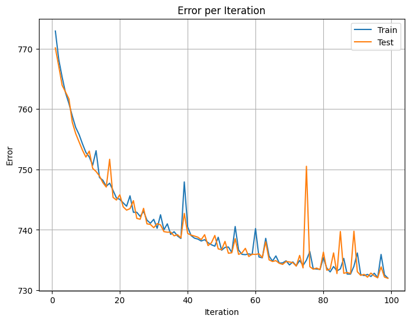
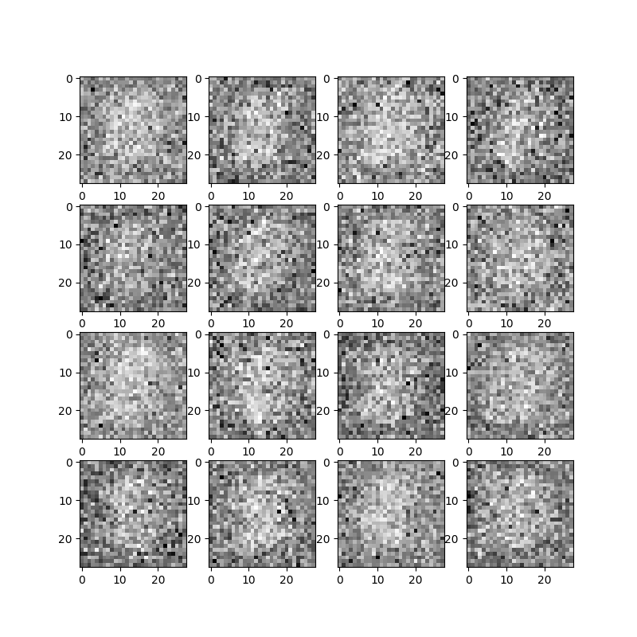
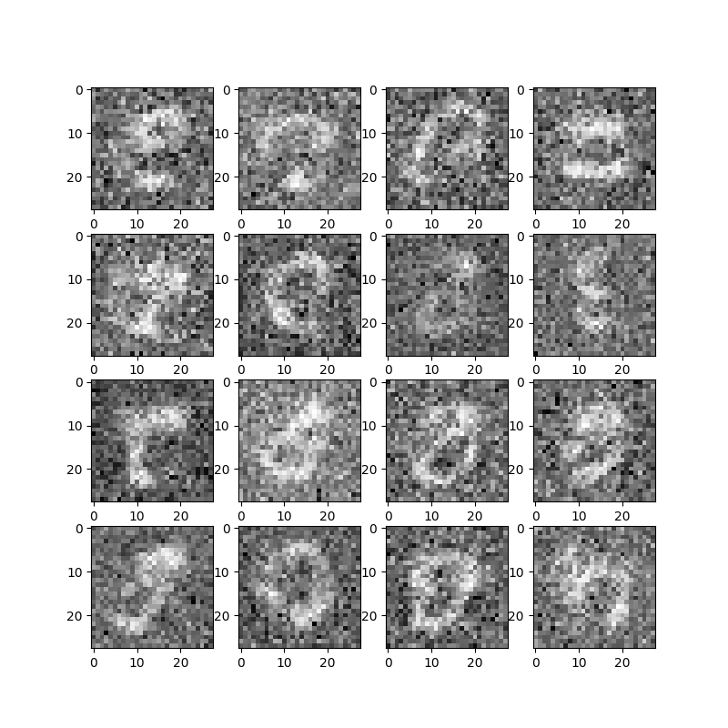
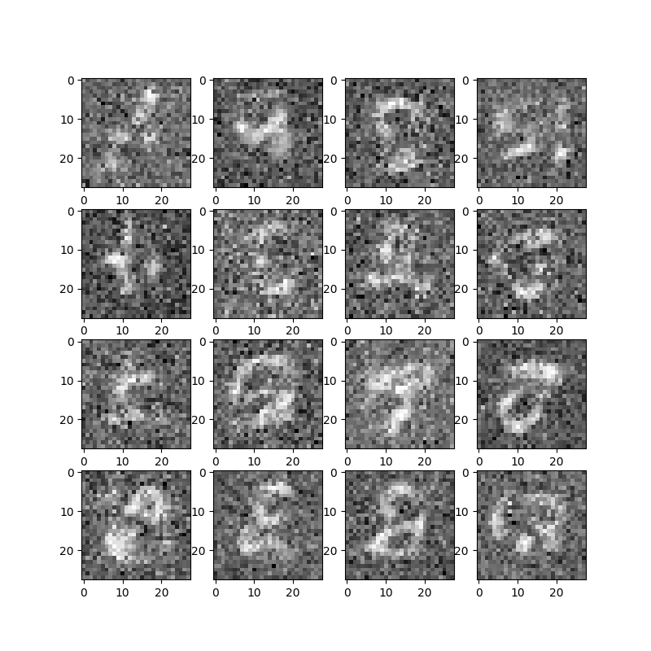
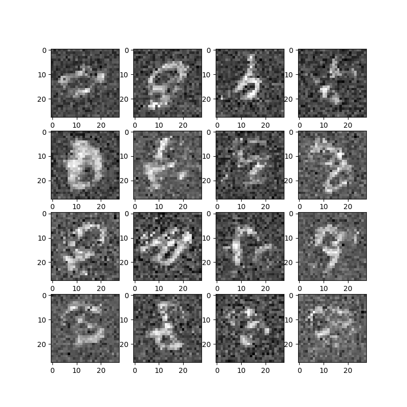

  

# Real NVP Implementation in Pytorch

This project is an implementation of the Real Non-Volume Preserving (Real-NVP) networks for density estimation. The Real-NVP model is a type of normalizing flow that has shown success in capturing complex distributions. The original paper, "Density estimation using Real NVP" by Laurent Dinh, Jascha Sohl-Dickstein, and Samy Bengio, can be found [Here](https://arxiv.org/abs/1605.08803).
## Paper Overview
The paper introduces Real-NVP as a generative model designed for density estimation tasks. The key contributions and characteristics of the Real-NVP model are as follows:

### Model Architecture
The Real-NVP architecture comprises multiple coupling layers, each responsible for transforming the input data through a series of operations. Here's a breakdown of how these coupling layers operate and contribute to the overall architecture:

### 1. Coupling Layers:

The model is composed of multiple coupling layers, each performing the following operations:

- **Splitting Input:**
  - The input data is split into two parts, typically referred to as the "conditioning" and "transformed" parts.
  - The alternating choice of which part is transformed distinguishes different coupling layers.

- **Affine Transformation:**
  - The primary operation within each coupling layer is an affine transformation applied to the conditioning part.
  - The transformation is defined as:
    $y = x \odot \exp(s) + t,$
    where $x$ is the input, $\odot$ denotes element-wise multiplication, $s$ is the scale factor, $t$ is the translation vector, and $y$ is the transformed output.
  - The other part remains unchanged.

- **Invertibility:**
  - Invertibility is a key characteristic, allowing the model to reconstruct the original input from the transformed output.

- **Alternating Pattern:**
  - The alternating pattern of which part is transformed helps capture complex dependencies within the data.

### 2. Multiple Coupling Layers:

The model stacks multiple coupling layers to form a deep architecture:

- **Iterative Transformations:**
  - The input undergoes these coupling layers iteratively, with each layer contributing to the refinement of the data representation.

### 3. Transformation from Simple to Complex Distribution:

The model takes a simple base distribution, often a multivariate Gaussian distribution, and transforms it into a more complex distribution during forward propagation:

- **Deforming the Distribution:**
  - The transformations through the coupling layers progressively deform the simple base distribution to match the characteristics of the target data distribution closely.

### 4. Paper-Specific Elements:

The original Real-NVP paper introduces certain elements that we have not implemented in this project, and these include:

- **Masking Convolutions:**
  - The paper discusses the use of masking convolutions as a mechanism for implementing the coupling layers. This technique involves selectively applying the transformation to specific dimensions of the input.
  - While this feature is mentioned in the paper, our implementation in this project may not incorporate masking convolutions.

- **Batch Normalization:**
  - Batch normalization is introduced in the paper as a method to stabilize and accelerate the training process.
  - In this project, we may not have implemented batch normalization, and the model relies on other techniques for stability during training.

By omitting these specific elements, our implementation focuses on the core architecture of Real-NVP, showcasing its ability to transform a simple distribution into a complex one through multiple coupling layers while maintaining invertibility.

Adjusting the depth and configuration of the coupling layers allows for flexibility in modelling various data distributions.

## Implementation Details

### Framework and Dataset:

The Real-NVP model has been implemented using PyTorch, a popular deep-learning framework. The implementation is trained and evaluated on the MNIST dataset, a standard benchmark dataset for image classification.

### Model Architecture:

#### Networks for $s$ and $t$:

- Two separate networks are defined for the scaling ($s$) and translation ($t$) functions.
- Each network consists of four fully connected layers.
- The number of units in each layer follows an increasing-decreasing pattern: e.g., [64, 128, 128, 64].
- Rectified Linear Unit (ReLU) activation functions are used.

#### NVPBlock:

- A custom module, `NVPBlock`, is defined to encapsulate the operations of a coupling layer.
- The `NVPBlock` includes two methods: `forward` and `backward`.
  - `forward` implements the forward transformation defined in the Real-NVP paper, applying the affine transformation to the input.
  - `backward` implements the inverse transformation, allowing the reconstruction of the original input from the transformed output.

#### Overall Architecture:

- The Real-NVP model is constructed by stacking four `NVPBlock` modules sequentially.
- Each `NVPBlock` module is responsible for transforming a subset of dimensions in the input data.

### Training Parameters:

- **Learning Rate:** The model is trained with a learning rate of $1 \times 10^{-3}$.
- **Epochs:** Training is performed for 100 epochs.

### Training Process:

- **Loss Function:** The negative log-likelihood is used as the loss function.
- **Optimizer:** Adam Optimizer is used as the optimizer.

### Activation Functions:

- **ReLU:** Rectified Linear Unit is used as the activation function for intermediate layers.
### Training Configuration:

- The model undergoes training using the MNIST dataset for 100 epochs.
- The learning rate is chosen to be $1 \times 10^{-3}$ to carefully control the weight updates during training.
  
### Results:
- Here are the Error values per epoch:
  

- Here are the generated Images in each epoch:
    - Epoch 0:
      

    - Epoch 9:
      

    - Epoch 20:
      

    - Epoch 90:
      

  - Here are the generated images in each epoch:
      

### Considerations:

- The implementation does not include masking convolutions, as mentioned in the original paper.
- Batch normalization is not used in this specific implementation.

### Summary:

This Real-NVP implementation in PyTorch follows the architecture and training configuration described in the paper. It leverages separate networks for scaling and translation functions, incorporates custom coupling layers (NVPBlocks), and utilizes a specific pattern for the number of units in each layer. The training process involves optimizing the negative log-likelihood using SGD with a carefully chosen learning rate over 100 epochs. The implementation demonstrates the application of Real-NVP to the MNIST dataset for density estimation.

This description provides an overview of the key aspects of the implementation, offering insights into the architecture, training parameters, and specific choices made during the implementation process. Adjustments and refinements can be made based on further experimentation and analysis of results.
